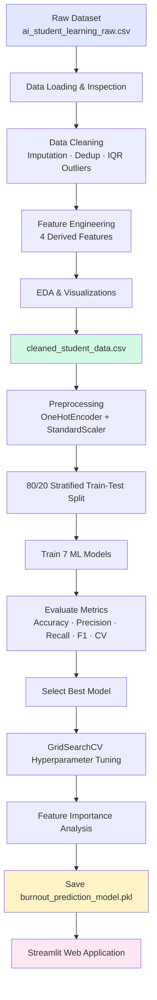

# AI Impact on Student Learning – Burnout Risk Prediction

[](https://www.python.org/)
[](https://scikit-learn.org/)
[](https://streamlit.io/)
[]()

A complete end-to-end Machine Learning project that predicts **student burnout risk** (`Low`, `Medium`, `High`) based on academic performance, Generative AI usage patterns, study habits, institutional policy, and wellbeing indicators. The project includes data cleaning, exploratory data analysis (EDA), multi-model benchmarking, hyperparameter tuning, feature importance analysis, and a production-ready **Streamlit** web application.

---

## Table of Contents

1. [Project Overview](#1-project-overview)
2. [Dataset Description](#2-dataset-description)
3. [Workflow Diagram](#3-workflow-diagram)
4. [Data Cleaning Process](#4-data-cleaning-process)
5. [EDA Summary](#5-eda-summary)
6. [Machine Learning Models Used](#6-machine-learning-models-used)
7. [Model Comparison](#7-model-comparison)
8. [Final Model Selection](#8-final-model-selection)
9. [Feature Importance Analysis](#9-feature-importance-analysis)
10. [Screenshots](#10-screenshots)
11. [Future Scope](#11-future-scope)
12. [Installation Guide](#12-installation-guide)
13. [Usage & Commands](#13-usage--commands)
14. [Project Structure](#14-project-structure)
15. [Dependencies](#15-dependencies)
16. [Reports & Artifacts](#16-reports--artifacts)
17. [Authors & Acknowledgements](#17-authors--acknowledgements)

---

## 1. Project Overview

### Problem Statement

The rapid adoption of Generative AI (GenAI) tools in higher education has transformed how students learn, complete assignments, and prepare for exams. While AI can improve productivity, excessive or unstructured usage may contribute to academic stress, shallow learning, and **burnout**.

This project investigates the relationship between AI usage, academic metrics, and student wellbeing to **predict burnout risk levels** and provide actionable insights through an interactive dashboard.

### Objectives

| # | Objective | Status |
|---|-----------|--------|
| 1 | Collect and clean student learning dataset | ✅ Complete |
| 2 | Perform exploratory data analysis (EDA) | ✅ Complete |
| 3 | Engineer domain-specific features | ✅ Complete |
| 4 | Train and compare 7 ML classifiers | ✅ Complete |
| 5 | Select best model via cross-validation | ✅ Complete |
| 6 | Tune hyperparameters with GridSearchCV | ✅ Complete |
| 7 | Analyze feature importance | ✅ Complete |
| 8 | Deploy interactive Streamlit application | ✅ Complete |

### Target Variable

**`Burnout_Risk_Level`** — Multi-class classification with three labels:

| Class | Description |
|-------|-------------|
| `Low` | Sustainable study-AI balance; low burnout indicators |
| `Medium` | Moderate risk; stress signals present |
| `High` | Elevated burnout risk; intervention recommended |

### Key Outcomes

- **46,735** cleaned student records after preprocessing
- **7 models** benchmarked with 5-fold stratified cross-validation
- **Logistic Regression** selected as the final model (F1 = 0.5146 after tuning)
- Deployable `.pkl` model artifact and Streamlit web app

---

## 2. Dataset Description

### Source Files

| File | Records | Columns | Description |
|------|---------|---------|-------------|
| `data/ai_student_learning_raw.csv` | 50,001 | 16 | Raw input dataset |
| `data/cleaned_student_data.csv` | 46,735 | 20 | Cleaned + engineered dataset |

### Feature Schema

| Feature | Type | Description |
|---------|------|-------------|
| `Student_ID` | Identifier | Unique student identifier (dropped during modeling) |
| `Major_Category` | Categorical | Field of study: STEM, Business, Humanities, Medical, Arts |
| `Year_of_Study` | Categorical | Freshman, Sophomore, Junior, Senior, Graduate |
| `Pre_Semester_GPA` | Numerical | GPA before the semester (1.8 – 4.0) |
| `Post_Semester_GPA` | Numerical | GPA after the semester (1.9 – 4.0) |
| `Weekly_GenAI_Hours` | Numerical | Hours/week using Generative AI tools |
| `Primary_Use_Case` | Categorical | Main AI use: Debugging, Ideation, Copywriting, etc. |
| `Prompt_Engineering_Skill` | Categorical | Beginner, Intermediate, Advanced |
| `Tool_Diversity` | Numerical | Number of distinct AI tools used (1 – 5) |
| `Paid_Subscription` | Boolean | Whether student pays for AI services |
| `Traditional_Study_Hours` | Numerical | Weekly offline study hours |
| `Perceived_AI_Dependency` | Numerical | Self-reported dependency rating (1 – 10) |
| `Institutional_Policy` | Categorical | Strict_Ban, Allowed_With_Citation, Actively_Encouraged |
| `Anxiety_Level_During_Exams` | Numerical | Exam anxiety scale (1 – 10) |
| `Skill_Retention_Score` | Numerical | Knowledge retention score (0 – 100) |
| **`Burnout_Risk_Level`** | **Target** | **Low / Medium / High** |

### Engineered Features

| Feature | Formula | Purpose |
|---------|---------|---------|
| `GPA_Improvement` | Post_GPA − Pre_GPA | Academic trajectory |
| `AI_Efficiency` | GPA_Improvement / (Weekly_GenAI_Hours + 1) | GPA return per AI hour |
| `Study_Balance` | Traditional_Study_Hours / (Weekly_GenAI_Hours + 1) | Offline-to-AI study ratio |
| `Dependency_Index` | (Perceived_AI_Dependency × Weekly_GenAI_Hours) / (Traditional_Study_Hours + 1) | Composite AI dependency score |

### Class Distribution (Cleaned Dataset)

The target variable is moderately imbalanced across three classes, which is why **stratified splitting** and **weighted F1 scoring** are used during model evaluation.

---

## 3. Workflow Diagram

### End-to-End Pipeline



### Phase Breakdown

```
Phase 1 ─ Data Engineering          Phase 2 ─ Machine Learning         Phase 3 ─ Deployment
─────────────────────────          ──────────────────────────          ─────────────────────
main.py                            main_phase2.py                       app/streamlit_app.py
├── data_loader.py                 ├── preprocessor.py                  ├── services/
├── data_cleaner.py                ├── model_trainer.py                 ├── components/
├── feature_engineering.py         ├── hyperparameter_tuner.py          └── styles/custom.css
└── eda.py                         └── feature_importance.py
```

---

## 4. Data Cleaning Process

The cleaning pipeline is implemented in `src/data_cleaner.py` and executed via `main.py`.

### Step-by-Step Process

| Step | Operation | Method / Details |
|------|-----------|------------------|
| 1 | **Missing Value Imputation** | Median for numerical columns; mode for categorical columns |
| 2 | **Duplicate Removal** | Drop exact duplicate rows to prevent sampling bias |
| 3 | **Data Type Correction** | Cast categoricals to `category` dtype; enforce float/int for numerics |
| 4 | **Outlier Removal (IQR)** | Apply 1.5× IQR rule on: `Weekly_GenAI_Hours`, `Traditional_Study_Hours`, `Pre_Semester_GPA`, `Post_Semester_GPA`, `Skill_Retention_Score` |
| 5 | **Feature Engineering** | Create 4 derived features (see Section 2) |
| 6 | **Export** | Save to `data/cleaned_student_data.csv` |

### Records Summary

| Stage | Row Count |
|-------|-----------|
| Raw dataset | 50,001 |
| After cleaning & outlier removal | ~46,735 |
| Training set (80%) | 37,388 |
| Test set (20%) | 9,347 |

---

## 5. EDA Summary

Exploratory analysis is performed by `src/eda.py` and documented in `reports/eda_summary_report.md`. Ten high-resolution visualizations are exported to `reports/figures/`.

### Key Findings

1. **Burnout Risk vs. AI Usage**
   - Students spending **> 20 weekly GenAI hours** with **< 8 traditional study hours** show significantly higher **High** burnout proportions.

2. **Exam Anxiety & Burnout**
   - Strong positive correlation between `Anxiety_Level_During_Exams` and `Burnout_Risk_Level`.
   - Students with anxiety ≥ 7 predominantly fall into **Medium** or **High** burnout categories.

3. **Prompt Engineering Skill & Retention**
   - **Advanced** prompt engineering correlates with higher `Skill_Retention_Score`, even at moderate-to-high AI usage — suggesting skilled AI use supports learning rather than replacing it.

4. **GPA Dynamics**
   - Moderate AI usage (5 – 12 hrs/week) associates with positive `GPA_Improvement`.
   - Extreme usage (> 25 hrs/week) correlates with diminishing or negative GPA returns.

### EDA Visualizations

| File | Description |
|------|-------------|
| `correlation_heatmap.png` | Feature correlation matrix |
| `burnout_risk_distribution.png` | Target class distribution |
| `ai_usage_distribution.png` | GenAI hours by burnout level |
| `gpa_distribution.png` | Pre vs. Post semester GPA |
| `study_hours_distribution.png` | Traditional vs. AI study hours |
| `anxiety_distribution.png` | Exam anxiety by burnout tier |
| `histograms.png` | Numerical feature distributions |
| `boxplots.png` | Outlier visualization |
| `pairplots.png` | Pairwise feature scatter matrix |
| `countplots.png` | Categorical feature breakdowns |

---

## 6. Machine Learning Models Used

Seven classification algorithms were trained and evaluated in `src/model_trainer.py`:

| # | Model | Algorithm | Key Configuration |
|---|-------|-----------|-------------------|
| 1 | **Logistic Regression** | Linear multi-class classifier | `max_iter=1000` |
| 2 | **Decision Tree** | `DecisionTreeClassifier` | Default splits |
| 3 | **Random Forest** | Ensemble of decision trees | `n_estimators=50` |
| 4 | **Support Vector Machine** | `LinearSVC` | `dual=False`, scaled features |
| 5 | **K-Nearest Neighbors** | Instance-based learning | `n_neighbors=5`, `kd_tree` |
| 6 | **Gradient Boosting** | `HistGradientBoostingClassifier` | Histogram-based boosting |
| 7 | **XGBoost** | `XGBClassifier` | `n_estimators=50`, `mlogloss` |

### Preprocessing Pipeline

| Step | Technique | Applied To |
|------|-----------|------------|
| Categorical Encoding | `OneHotEncoder` (handle_unknown='ignore') | 5 categorical features |
| Numerical Scaling | `StandardScaler` | 12 numerical features |
| Target Encoding | `LabelEncoder` | Burnout_Risk_Level → {0, 1, 2} |
| Train-Test Split | Stratified 80/20 | `random_state=42` |

**Final feature matrix:** 33 features (12 numerical + 21 one-hot encoded)

---

## 7. Model Comparison

All models were evaluated on the held-out test set (9,347 samples) with **weighted** precision, recall, and F1 (appropriate for multi-class imbalance). **5-fold stratified cross-validation** was performed on the training set.

| Rank | Model | Accuracy | Precision | Recall | F1 Score | 5-Fold CV F1 | Train Time (s) |
|------|-------|----------|-----------|--------|----------|--------------|----------------|
| 🥇 1 | **Logistic Regression** | **0.519** | **0.531** | **0.519** | **0.515** | **0.515** | 2.3 |
| 🥈 2 | Support Vector Machine | 0.517 | 0.528 | 0.517 | 0.512 | 0.511 | 7.0 |
| 🥉 3 | Gradient Boosting | 0.514 | 0.524 | 0.514 | 0.509 | 0.511 | 9.6 |
| 4 | XGBoost | 0.512 | 0.522 | 0.512 | 0.508 | 0.505 | 5.4 |
| 5 | Random Forest | 0.496 | 0.501 | 0.496 | 0.493 | 0.492 | 9.7 |
| 6 | K-Nearest Neighbors | 0.435 | 0.435 | 0.435 | 0.433 | 0.429 | 3.4 |
| 7 | Decision Tree | 0.422 | 0.422 | 0.422 | 0.422 | 0.424 | 4.4 |

> Full comparison charts: `reports/figures/model_comparison_metrics.png` and `reports/figures/confusion_matrices.png`

---

## 8. Final Model Selection

### Selected Model: Logistic Regression

| Criterion | Value |
|-----------|-------|
| Selection metric | Weighted F1 Score (test set) |
| Baseline F1 | 0.5145 |
| Tuned F1 | **0.5146** |
| Best hyperparameter | `C = 10.0` |
| Tuning method | `GridSearchCV` (5-fold, `f1_weighted`) |
| Search space | `C ∈ {0.01, 0.1, 1.0, 10.0, 100.0}` |

### Why Logistic Regression?

1. **Highest F1 score** among all 7 candidate models
2. **Fastest training** time (~2.3 seconds)
3. **Interpretable coefficients** — enables transparent feature importance analysis
4. **Stable cross-validation** performance (low std = 0.0026)
5. **Low overfitting risk** compared to complex tree ensembles on this dataset

### Per-Class Performance (Tuned Model)

| Class | Precision | Recall | F1-Score | Support |
|-------|-----------|--------|----------|---------|
| High | 0.61 | 0.35 | 0.45 | 2,021 |
| Low | 0.54 | 0.50 | 0.52 | 3,228 |
| Medium | 0.49 | 0.61 | 0.54 | 4,098 |
| **Weighted Avg** | **0.53** | **0.52** | **0.51** | **9,347** |

### Saved Artifact

```
models/burnout_prediction_model.pkl
```

Contains: `preprocessor`, `label_encoder`, `tuned_model`, `feature_names`, `target_names`, `tuned_metrics`

---

## 9. Feature Importance Analysis

Feature importance was extracted from Logistic Regression coefficients (mean absolute value across classes). Top predictors of burnout risk:

| Rank | Feature | Importance | Interpretation |
|------|---------|------------|----------------|
| 1 | `Weekly_GenAI_Hours` | 0.384 | Higher AI usage strongly predicts burnout |
| 2 | `Year_of_Study_Graduate` | 0.360 | Graduate students show distinct risk patterns |
| 3 | `Year_of_Study_Freshman` | 0.315 | First-year transition contributes to risk |
| 4 | `Year_of_Study_Sophomore` | 0.150 | Second-year academic pressure factor |
| 5 | `Institutional_Policy_Actively_Encouraged` | 0.113 | Policy environment influences outcomes |
| 6 | `Perceived_AI_Dependency` | 0.107 | Self-reported dependency is a key signal |
| 7 | `Institutional_Policy_Allowed_With_Citation` | 0.098 | Moderate policy stance effect |
| 8 | `Institutional_Policy_Strict_Ban` | 0.077 | Restrictive policies also correlate |
| 9 | `Traditional_Study_Hours` | 0.075 | Offline study time is protective |
| 10 | `Year_of_Study_Senior` | 0.068 | Senior year academic context |

> Visualization: `reports/figures/feature_importance.png`

---

## 10. Screenshots

> **Note:** Replace the placeholder paths below with actual screenshots before final submission.

### EDA Visualizations

| Description | Placeholder |
|-------------|-------------|
| Correlation Heatmap | `docs/screenshots/01_correlation_heatmap.png` |
| Burnout Risk Distribution | `docs/screenshots/02_burnout_distribution.png` |
| AI Usage vs. Burnout | `docs/screenshots/03_ai_usage_burnout.png` |

### Model Evaluation

| Description | Placeholder |
|-------------|-------------|
| Model Comparison Metrics | `docs/screenshots/04_model_comparison.png` |
| Confusion Matrices Grid | `docs/screenshots/05_confusion_matrices.png` |
| Feature Importance Chart | `docs/screenshots/06_feature_importance.png` |

### Streamlit Application

| Description | Placeholder |
|-------------|-------------|
| App Home / Welcome Screen | `docs/screenshots/07_streamlit_home.png` |
| Sidebar Input Form | `docs/screenshots/08_streamlit_sidebar.png` |
| Prediction Results Dashboard | `docs/screenshots/09_streamlit_prediction.png` |
| Probability & Gauge Charts | `docs/screenshots/10_streamlit_charts.png` |
| Recommendations Panel | `docs/screenshots/11_streamlit_recommendations.png` |

**To capture screenshots:**

```bash
# Copy existing report figures
mkdir -p docs/screenshots
cp reports/figures/*.png docs/screenshots/

# For Streamlit screenshots: run the app and use your OS screenshot tool
streamlit run app/streamlit_app.py
```

---

## 11. Future Scope

| Area | Enhancement |
|------|-------------|
| **Model Improvement** | Apply SMOTE / class weights to improve High-burnout recall (currently 35%) |
| **Deep Learning** | Experiment with neural networks and tabular transformers (TabNet, FT-Transformer) |
| **Real-Time Data** | Integrate live university LMS and wellbeing survey APIs |
| **Explainability** | Add SHAP values and LIME for per-prediction explanations in the Streamlit app |
| **Multi-Target Prediction** | Jointly predict burnout risk and GPA trajectory |
| **Mobile App** | Deploy as a React Native / Flutter companion app for students |
| **Institutional Dashboard** | Admin panel for universities to monitor cohort-level burnout trends |
| **A/B Testing** | Evaluate intervention recommendations through controlled experiments |
| **MLOps Pipeline** | Automate retraining with MLflow, DVC, and CI/CD on GitHub Actions |
| **Data Expansion** | Collect longitudinal data across multiple semesters per student |

---

## 12. Installation Guide

### Prerequisites

- **Python** 3.10 or higher
- **pip** (Python package manager)
- **Git** (optional, for cloning)
- **8 GB RAM** recommended (dataset has ~47K rows)

### Step 1: Clone or Download the Repository

```bash
git clone https://github.com/Ranigit777/AI_Impact_On_Student_learning.git
cd AI_Impact_On_Student_learning
```

### Step 2: Create a Virtual Environment

**Windows (PowerShell):**

```powershell
python -m venv venv
.\venv\Scripts\Activate.ps1
```

**Windows (Command Prompt):**

```cmd
python -m venv venv
venv\Scripts\activate.bat
```

**macOS / Linux:**

```bash
python3 -m venv venv
source venv/bin/activate
```

### Step 3: Install Dependencies

```bash
pip install --upgrade pip
pip install -r requirements.txt
```

### Step 4: Verify Installation

```bash
python -c "import pandas, sklearn, xgboost, streamlit, plotly, joblib; print('All dependencies OK')"
```

---

## 13. Usage & Commands

### Quick Reference

| Task | Command |
|------|---------|
| Create virtual environment | `python -m venv venv` |
| Activate (Windows PS) | `.\venv\Scripts\Activate.ps1` |
| Activate (macOS/Linux) | `source venv/bin/activate` |
| Install dependencies | `pip install -r requirements.txt` |
| Phase 1: Clean data + EDA | `python main.py` |
| Phase 2: Train models | `python main_phase2.py` |
| Launch Streamlit app | `streamlit run app/streamlit_app.py` |
| Run automated tests | `python tests/test_prediction.py` |

---

### Phase 1 — Data Cleaning & EDA

Loads the raw dataset, cleans it, engineers features, generates EDA plots, and exports `cleaned_student_data.csv`.

```bash
python main.py
```

**Outputs:**
- `data/cleaned_student_data.csv`
- `reports/figures/*.png` (10 EDA charts)

---

### Phase 2 — Model Training & Evaluation

Trains all 7 models, compares metrics, tunes the best model, analyzes feature importance, and saves the model artifact.

```bash
python main_phase2.py
```

**Outputs:**
- `models/burnout_prediction_model.pkl`
- `reports/model_evaluation_report.md`
- `reports/figures/model_comparison_metrics.png`
- `reports/figures/confusion_matrices.png`
- `reports/figures/feature_importance.png`

---

### Phase 3 — Streamlit Web Application

Launches the interactive burnout risk prediction dashboard.

```bash
streamlit run app/streamlit_app.py
```

The app opens at **http://localhost:8501** by default.

**App Features:**
- Sidebar with 10 student profile inputs
- Real-time burnout risk prediction with probabilities
- Interactive Plotly charts (probability bars, gauge, radar, feature importance)
- Personalized wellness recommendations
- Professional custom CSS theme

---

### Test the Application

Run the automated test suite to verify model loading and prediction:

```bash
python tests/test_prediction.py
```

**Manual smoke test (single prediction):**

```bash
python -c "
import sys; sys.path.insert(0, '.')
from app.services.predictor import predict_burnout
result = predict_burnout({
    'major_category': 'STEM', 'year_of_study': 'Junior',
    'weekly_ai_hours': 10.0, 'study_hours': 12.0,
    'anxiety_level': 5, 'prompt_skill': 'Intermediate',
    'paid_subscription': False, 'tool_diversity': 3,
    'skill_retention': 75.0, 'gpa': 3.2
})
print('Risk:', result['risk_level'])
print('Probabilities:', result['probabilities'])
"
```

**Test Streamlit app imports:**

```bash
python -c "import sys; sys.path.insert(0,'.'); from app.streamlit_app import main; print('Streamlit app imports OK')"
```

---

## 14. Project Structure

```
AI_Student_ML_Project/
│
├── app/                                # Phase 3: Streamlit Web Application
│   ├── streamlit_app.py                #   Main app entry point
│   ├── config.py                       #   Constants, options, styling
│   ├── utils.py                        #   Page config, CSS loader
│   ├── components/
│   │   ├── sidebar_inputs.py           #   Sidebar form (10 inputs)
│   │   ├── results_panel.py            #   Prediction summary & recommendations
│   │   └── charts.py                   #   Plotly visualizations
│   ├── services/
│   │   ├── model_loader.py             #   Load & cache .pkl model
│   │   ├── input_builder.py            #   Map UI inputs → model features
│   │   ├── predictor.py                #   Run inference
│   │   └── recommendations.py          #   Wellness advice engine
│   └── styles/
│       └── custom.css                  #   Professional UI theme
│
├── data/
│   ├── ai_student_learning_raw.csv     # Raw dataset (50,001 records)
│   └── cleaned_student_data.csv        # Cleaned dataset (46,735 records)
│
├── models/
│   └── burnout_prediction_model.pkl    # Trained model artifact
│
├── notebooks/
│   ├── 01_eda_and_data_cleaning.ipynb  # Interactive EDA notebook
│   └── 02_model_training_and_evaluation.ipynb
│
├── reports/
│   ├── eda_summary_report.md           # Phase 1 EDA report
│   ├── model_evaluation_report.md      # Phase 2 model report
│   └── figures/                        # All generated charts (.png)
│
├── src/                                # Core ML pipeline modules
│   ├── data_loader.py                  #   Dataset loading & inspection
│   ├── data_cleaner.py                 #   Cleaning pipeline
│   ├── feature_engineering.py          #   Feature creation
│   ├── eda.py                          #   EDA visualizations
│   ├── preprocessor.py                 #   Encoding & scaling
│   ├── model_trainer.py                #   7-model training & evaluation
│   ├── hyperparameter_tuner.py         #   GridSearchCV tuning
│   └── feature_importance.py           #   Importance extraction & plots
│
├── tests/
│   └── test_prediction.py              # Automated prediction tests
│
├── docs/
│   └── screenshots/                    # Screenshot placeholders
│
├── main.py                             # Phase 1 pipeline runner
├── main_phase2.py                      # Phase 2 pipeline runner
├── requirements.txt                    # Python dependencies
└── README.md                           # This documentation
```

---

## 15. Dependencies

All dependencies are listed in `requirements.txt`:

| Package | Version | Purpose |
|---------|---------|---------|
| `pandas` | ≥ 2.0.0 | Data manipulation |
| `numpy` | ≥ 1.24.0 | Numerical computing |
| `matplotlib` | ≥ 3.7.0 | Static visualizations |
| `seaborn` | ≥ 0.12.0 | Statistical plots |
| `scikit-learn` | ≥ 1.2.0 | ML algorithms & preprocessing |
| `xgboost` | ≥ 2.0.0 | Gradient boosting classifier |
| `joblib` | ≥ 1.3.0 | Model serialization |
| `streamlit` | ≥ 1.28.0 | Web application framework |
| `plotly` | ≥ 5.18.0 | Interactive charts |
| `tabulate` | ≥ 0.9.0 | Markdown table generation |
| `jupyter` | ≥ 1.0.0 | Interactive notebooks |

Install all at once:

```bash
pip install -r requirements.txt
```

---

## 16. Reports & Artifacts

| Artifact | Path | Description |
|----------|------|-------------|
| Cleaned Dataset | `data/cleaned_student_data.csv` | 46,735 rows × 20 columns |
| Trained Model | `models/burnout_prediction_model.pkl` | Full inference package |
| EDA Report | `reports/eda_summary_report.md` | Phase 1 findings |
| Model Report | `reports/model_evaluation_report.md` | Phase 2 benchmark results |
| EDA Figures | `reports/figures/` | 10 exploratory charts |
| ML Figures | `reports/figures/` | Comparison, confusion matrix, importance |

---

## 17. Authors & Acknowledgements

### Project Information

| Field | Detail |
|-------|--------|
| **Project Title** | AI Impact on Student Learning – Burnout Risk Prediction |
| **Domain** | Machine Learning · Educational Data Mining · Student Wellbeing |
| **Type** | Final-Year Project / Academic Capstone |
| **Tech Stack** | Python · scikit-learn · XGBoost · Streamlit · Plotly |

### Acknowledgements

- Dataset synthesized for academic research on AI impact in higher education
- Built with [scikit-learn](https://scikit-learn.org/), [XGBoost](https://xgboost.readthedocs.io/), and [Streamlit](https://streamlit.io/)
- EDA and modeling follow CRISP-DM methodology

---

## License

This project is intended for **academic and educational purposes**. Please cite appropriately if used in research or coursework.

---
## Clone
git clone https://github.com/Ranigit777/AI_Impact_On_Student_learning.git
cd AI_Impact_On_Student_learning
python -m venv venv
.\venv\Scripts\Activate.ps1   # Windows
pip install -r requirements.txt
streamlit run app/streamlit_app.py

<p align="center">
  <strong>AI Impact on Student Learning – Burnout Risk Prediction</strong><br>
  Predicting student wellbeing in the age of Generative AI
</p>
